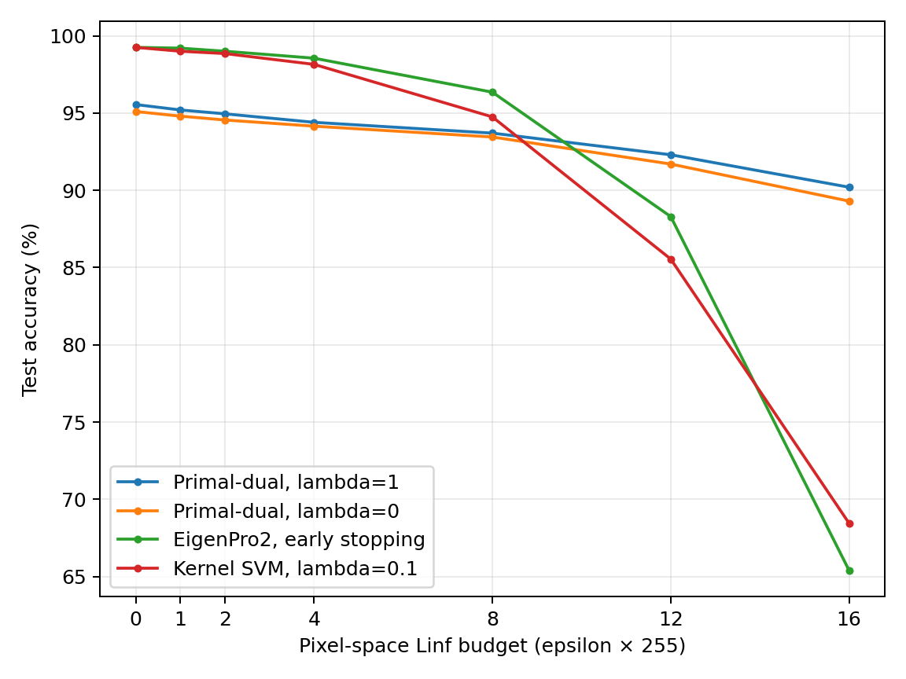

# Fashion-MNIST 0 vs 1: all attack budgets

Test accuracy (%) on all 2,000 official test images. Epsilon=0 is clean.
Same fixed checkpoints and binary-compatible AutoAttack (APGD-CE, FAB, Square), seed 42.
APGD-CE/FAB: 100 iterations, 5 restarts; Square: 5,000 queries.

| Model | eps=0/255 | eps=1/255 | eps=2/255 | eps=4/255 | eps=8/255 | eps=12/255 | eps=16/255 |
|---|---:|---:|---:|---:|---:|---:|---:|
| Primal-dual, lambda=1 | 95.55 | 95.20 | 94.95 | 94.40 | 93.70 | 92.30 | 90.20 |
| Primal-dual, lambda=0 | 95.10 | 94.80 | 94.55 | 94.15 | 93.45 | 91.70 | 89.30 |
| EigenPro2, early stopping | 99.25 | 99.20 | 99.00 | 98.55 | 96.35 | 88.30 | 65.40 |
| Kernel SVM, lambda=0.1 | 99.25 | 99.00 | 98.85 | 98.15 | 94.75 | 85.55 | 68.45 |

Lambda=1 used 12,000 training samples and length scale 8.90477.
The other models share 10,800 training / 1,200 validation samples and length scale 9.05994.
No retraining or test-based model selection. Existing 8/255 results are reused.
Individual attack runs are empirical evaluations, not robustness certificates.

