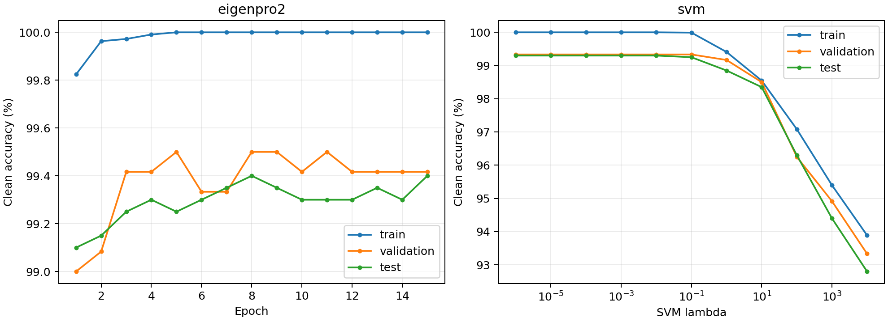

# Fashion-MNIST 0 vs 1: Matérn-5/2 baseline comparison

| Model | Train accuracy | Validation accuracy | Clean test | AutoAttack at 8/255 |
|---|---:|---:|---:|---:|
| EigenPro2, selected epoch 5 | 100.00% | 99.50% | 99.25% | 96.35% |
| Kernel SVM, lambda=0.1 (C=10) | 99.99% | 99.33% | 99.25% | 94.75% |
| Primal-dual, lambda=1 | 96.51% | — | 95.55% | 93.70% |
| Primal-dual, lambda=0, selected epoch 26 | 96.42% | 95.67% | 95.10% | 93.45% |

All test results use the same 2,000 official test images, raw [0,1] pixels,
and binary-compatible AutoAttack: APGD-CE, FAB, and Square, with seed 42.
This is the same custom configuration used in the earlier experiments, not
AutoAttack's multiclass standard preset. Full logs are in each model folder.

The two new baselines reuse the lambda-zero model's exact stratified
10,800/1,200 training/validation split and fixed train-only median length
scale 9.05993938446045. No length-scale tuning was performed. The original
lambda-one primal-dual model used 12,000 training images and median length
scale 8.904768943786621, so that row is not a matched training-data ablation.
The earlier primal-dual runs were not established to be converged; these
results compare the particular trained checkpoints, not optimal objectives.

EigenPro2 uses squared loss with -1/+1 targets and early stopping as implicit
regularization, rather than an explicit positive ridge penalty. Its
preconditioner uses 1,024 samples and rank 100, with minibatch 128. Epoch 5
was the earliest best validation checkpoint; training stopped at epoch 15
with patience 10. See eigenpro2/training_metrics.csv for every epoch.

SVM searched lambda=10^4,...,10^-6 using clean validation accuracy only.
Ties retained the larger lambda. The objective is summed hinge loss plus
lambda/2 times squared RKHS norm; C=1/lambda and the intercept is
unregularized. Lambda=0.1 was selected with 528 support vectors. Lower
lambdas tied on validation accuracy; their test scores did not affect
selection. See svm/training_metrics.csv for every candidate. The selected
exported decision function agreed with libsvm within 2.57e-5 on training
samples, and the attack adapter includes the intercept and exact gradients.

The installed cuML failed to import because of conflicting CuPy/CUDA
packages. SVM fitting therefore used scikit-learn/libsvm on the exact
precomputed Matérn kernel, with GPU kernel construction and attacks.

Both baselines outperform the recorded primal-dual checkpoints on clean
and attacked accuracy at 8/255. EigenPro2 has the highest attacked accuracy
in this comparison. Baseline training imposed no adversarial-gradient penalty.

Checkpoint paths and SHA-256 hashes are recorded in results.json. Large
checkpoints and adversarial examples stay under runs/; report artifacts are
tracked in git. See ../../docs/baselines.md for reproduction details.

