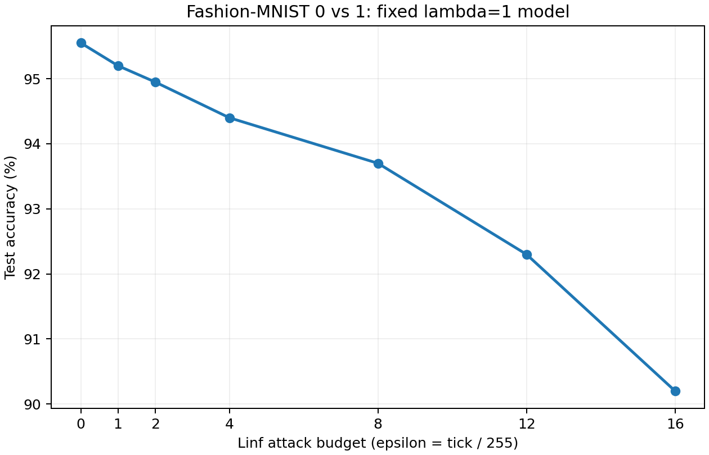

# Attack-budget sweep on the fixed lambda=1 model

All evaluations use the same saved weighted-average Matérn-5/2 logistic model,
trained with lambda=1 and rho=8/255. No retraining or test-based selection.
Binary-compatible custom AutoAttack: APGD-CE, FAB, and Square on all 2,000 test images.
APGD-CE/FAB each use 100 iterations and 5 restarts; Square uses 5,000 queries.

| Linf epsilon | Test accuracy |
|---:|---:|
| 0/255 | 95.55% |
| 1/255 | 95.20% |
| 2/255 | 94.95% |
| 4/255 | 94.40% |
| 8/255 | 93.70% |
| 12/255 | 92.30% |
| 16/255 | 90.20% |

0/255 is clean accuracy. The existing 8/255 result is reused.

See [manifest](manifest.json) for the checkpoint SHA-256 and code revisions,
[results](results.json), [CSV](accuracy.csv), and per-budget attack logs.
