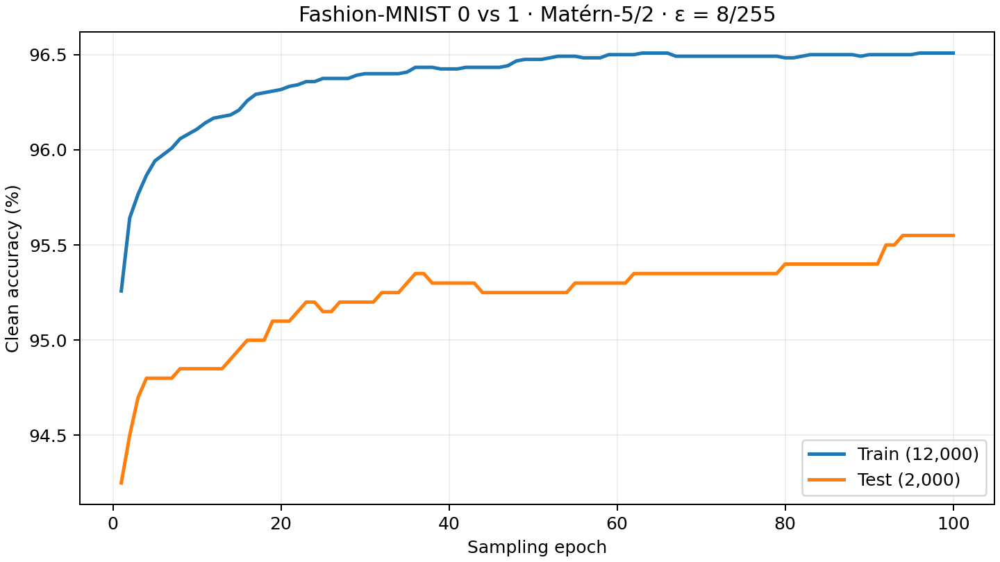

# Fashion-MNIST 0 vs 1: Matern-5/2 logistic RKHS

Completed on GPU 0 (RTX 5000 Ada). Official splits: 12,000 training and
2,000 test images. Raw pixels are in [0,1], epsilon=rho=8/255, lambda=1.
Length scale: 8.90476894, estimated from training data only.
Batch size 128, seed 42, 100 sampling epochs (9,400 updates).
eta_m = 0.0003332222592 / (m+1)^0.6. Reported and attacked model: the
eta-weighted average. No test-based model selection.

| Sampling epoch | Train accuracy | Test accuracy |
|---:|---:|---:|
| 0 | 50.00% | 50.00% |
| 1 | 95.26% | 94.25% |
| 10 | 96.11% | 94.85% |
| 25 | 96.38% | 95.15% |
| 50 | 96.47% | 95.25% |
| 100 | 96.51% | 95.55% |

Full per-epoch history: [training_metrics.csv](training_metrics.csv).

## Adversarial evaluation

- Clean test accuracy: **95.55%** (1,911 / 2,000).
- Robust test accuracy: **93.70%** (1,874 / 2,000).
- Threat model: Linf, epsilon=8/255, valid pixels [0,1].
- Official AutoAttack, binary-compatible **custom** configuration:
  APGD-CE (100 iterations, 5 restarts), untargeted FAB (100 iterations,
  5 restarts), Square (5,000 queries, 1 restart).
- DLR components are omitted because their losses do not support two classes.
  This is not the standard multiclass AutoAttack preset.
- Square found no additional failures. The denominator includes all test
  images, including initially misclassified ones.
- Maximum saved perturbation: 0.0313725546 (8/255 within float32 roundoff).

See [autoattack.log](autoattack.log), [result.json](result.json), and
[config.json](config.json), which records the solver and AutoAttack commits.

Training and accuracy/objective evaluation took about 28 seconds; the
AutoAttack evaluation took about 184 seconds. These are single-run timings.

## Optimization limitation

This is a fixed-budget experiment, not a convergence claim. The summed
training objective reached about 5,847 at epoch 10 and rose to about 6,156
at epoch 100, even as logistic loss decreased. The robustness penalty and
dual dynamics have not been demonstrated to converge at this budget.

The model and adversarial tensors are retained in
`runs/fashion01-matern52-eps8-255/model.pt` and `adversarial.pt` within that
same directory; large binary checkpoints are not committed. Reproduction
instructions are in [the experiment guide](../../docs/fashion01.md).
