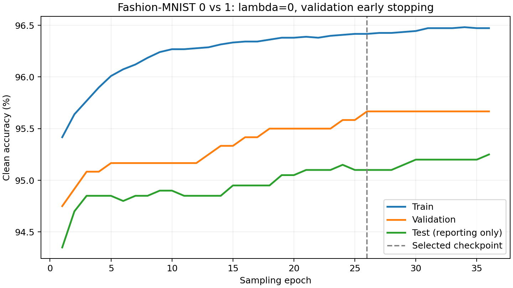

# Lambda=0 with validation early stopping

Matérn-5/2 logistic model, rho=8/255, raw [0,1] pixels.
Training/validation/test sizes: 10800/1200/2000.
The stratified validation split comes only from the original training split.
The test set was not used for selection. The weighted-average model is selected
by clean validation accuracy; ties retain the earliest best epoch.

Stopped at epoch 36; restored epoch **26**.

| Metric at selected checkpoint | Accuracy |
|---|---:|
| Train | 96.42% |
| Validation | 95.67% |
| Clean test | 95.10% |
| AutoAttack test, 8/255 | 93.45% |

AutoAttack uses the same binary-compatible custom APGD-CE/FAB/Square settings
as the original model, over all 2,000 test images.

See [full history](training_metrics.csv), [configuration](config.json),
[selection](selection.json), [attack result](result.json), and [attack log](autoattack.log).

The original lambda=1 experiment used all 12,000 training examples; this run
uses 10,800 after validation holdout and re-estimates the length scale.
The comparison therefore does not isolate lambda alone. This is an early-stopped
experiment, not an optimization convergence claim. The checkpoint and split
indices are saved under runs/fashion01-matern52-lambda0-val.
