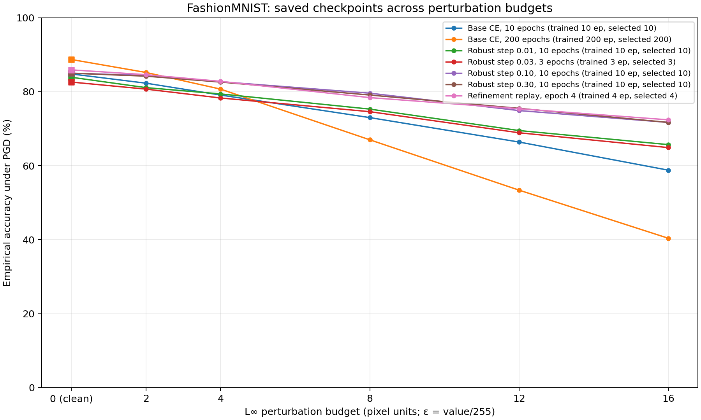

# FashionMNIST: PGD across perturbation budgets

Run artifacts: `/users/faculty/pandit/code/robust-kernels/reports/fashion10-epsilon-sweep-2026-10-02`.

These are empirical attacks on saved checkpoints. Training budgets and selected epochs are listed explicitly; checkpoints are not selected by attack performance. The evaluation does not certify robustness and does not constitute AutoAttack or an exhaustive attack search.

## Protocol

| Setting | Value |
| --- | --- |
| L∞ budgets (pixel units) | 0, 2, 4, 8, 12, 16 |
| Pixel denominator | 255 |
| Samples | 1000 |
| PGD steps | 20 |
| Random restarts | 1 |
| Attack seed | 42 |
| Step-size rule | epsilon/4 |

The ε=0 point is clean accuracy on the attack sample. Reported values cover the recorded sample and seed only, without uncertainty estimates across training or attack seeds. Finite PGD runs can produce nonmonotonic accuracy across budgets. The figure shows raw measured points joined for readability; no monotonic correction or missing-point estimates are applied. Per-point settings and checkpoint hashes are in comparison.csv.

## Checkpoints

| Model | Variant | Status | Training epochs | Selected epoch | Points recorded |
| --- | --- | --- | --- | --- | --- |
| Base CE, 10 epochs | baseline | complete | 10 | 10 | 6 |
| Base CE, 200 epochs | baseline | complete | 200 | 200 | 6 |
| Robust step 0.01, 10 epochs | robust | complete | 10 | 10 | 6 |
| Robust step 0.03, 3 epochs | robust | complete | 3 | 3 | 6 |
| Robust step 0.10, 10 epochs | robust | complete | 10 | 10 | 6 |
| Robust step 0.30, 10 epochs | robust | complete | 10 | 10 | 6 |
| Refinement replay, epoch 4 | single-epoch projection sensitivity: ten factor steps only in epoch four | complete | 4 | 4 | 6 |

## Empirical accuracy

| Model | 0 (clean) | 2/255 | 4/255 | 8/255 | 12/255 | 16/255 |
| --- | --- | --- | --- | --- | --- | --- |
| Base CE, 10 epochs | 84.80% | 82.30% | 79.10% | 73.00% | 66.40% | 58.80% |
| Base CE, 200 epochs | 88.70% | 85.20% | 80.70% | 67.00% | 53.40% | 40.40% |
| Robust step 0.01, 10 epochs | 83.90% | 81.10% | 79.40% | 75.30% | 69.50% | 65.70% |
| Robust step 0.03, 3 epochs | 82.60% | 80.70% | 78.30% | 74.60% | 68.90% | 64.90% |
| Robust step 0.10, 10 epochs | 85.00% | 84.40% | 82.70% | 79.60% | 74.90% | 71.70% |
| Robust step 0.30, 10 epochs | 85.00% | 84.20% | 82.60% | 79.10% | 75.50% | 71.70% |
| Refinement replay, epoch 4 | 85.90% | 84.60% | 82.80% | 78.40% | 75.40% | 72.40% |

