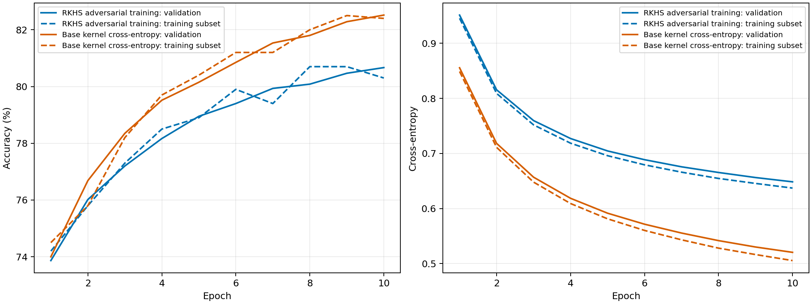

# FashionMNIST: ten-class kernel comparison

Run artifacts: `/users/faculty/pandit/code/robust-kernels/runs/fashion10-constant-step`.

Both models use raw image pixels in [0, 1], all ten FashionMNIST classes, a shared stratified training/validation split, and the official test set. Bandwidth is estimated from training data only.

The robust model uses the implemented RKHS stochastic primal/dual updates with rank-one derivative coefficients restored at projection boundaries. Its regularizer is the maximum classwise input-gradient L1 norm. The baseline minimizes multiclass cross-entropy using the KLR model and plain kernel SGD, without EigenPro preconditioning.

The coupled RKHS projection is approximate: it starts with rank-one block approximations and takes at most 3 factor refinement steps per projection. No global projection optimality is claimed. EigenPro is used only for the robust model's projection linear solves. The optional `dense` EigenPro storage mode caches the scalar training kernel matrix; it does not change the projection objective or add preconditioning to the baseline.

## Shared run configuration

| Setting | Value |
| --- | --- |
| dataset | "FashionMNIST" |
| classes | [0, 1, 2, 3, 4, 5, 6, 7, 8, 9] |
| seed | 42 |
| train_samples | 54000 |
| validation_samples | 6000 |
| test_samples | 10000 |
| train_per_class | null |
| validation_fraction | 0.1 |
| kernel | "matern52" |
| length_scale | 11.510018348693848 |
| lam | 0.0 |
| rho | 0.03137254901960784 |
| epsilon | 0.03137254901960784 |
| robust_eta | 2.37037037037037e-05 |
| robust_decay | 0.0 |
| baseline_eta | 0.01 |
| batch_size | 128 |
| project_every | 1 |
| projection_steps | 3 |
| solve_rtol | 0.001 |
| solve_atol | 1e-06 |
| solve_max_epochs | 300 |
| eigenpro_storage | "dense" |
| eigenpro_samples | 1024 |
| eigenpro_rank | 100 |
| epochs | 200 |
| patience | 10 |
| selection | "lowest validation cross-entropy after complete projected epochs" |
| code_commit | "f4db937e887aa8282fe13646c0d1230b4c222269" |
| baseline_update | "alpha[batch] -= eta * (softmax(logits) - one_hot(labels)); no preconditioner" |
| penalty | "rho * max_class sum_input abs(J[class,input])" |
| attack_per_class | 100 |
| attack_steps | 20 |
| attack_step_size | 0.00784313725490196 |
| robust_effective_epoch_limit | 10 |
| baseline_effective_epoch_limit | 10 |

## Selected checkpoints

Final metrics below come only from saved result files. Checkpoint selection uses validation cross-entropy; test performance is reported after selection. Training time is the accumulated training time recorded by the runner, not total wall time.

| Model | Status | Training stop | Selected epoch | Epochs run | Training seconds |
| --- | --- | --- | --- | --- | --- |
| RKHS adversarial training | complete | epoch cap reached | 10 | 10 | 2209.4 |
| Base kernel cross-entropy | complete | epoch cap reached | 10 | 10 | 6.9 |

Reaching the epoch cap is not evidence of optimizer convergence. The selected epoch remains the best validation checkpoint among the epochs actually run.

## Projection diagnostics

Diagnostics cover 10 recorded projected epochs. Termination reasons: `already_rank_one`: 1, `max_steps`: 9.

`max_steps` means the factor-step budget was reached; `stationary` reports the solver's first-order stopping test. Neither establishes a globally optimal projection. `already_rank_one` means compression was unnecessary for that target.

Latest recorded projection:

| Diagnostic | Value |
| --- | --- |
| Epoch | 10 |
| Termination reason | max_steps |
| Factor steps | 3 |
| Initial squared RKHS error | 0.548365 |
| Final squared RKHS error | 0.351154 |
| Maximum training-logit correction error | 0.00132948 |
| Final solve maximum relative residual | 0.000943701 |
| Final solve maximum scaled residual | 0.943629 |
| Full-center EigenPro diagonal bound | 0.689774 |
| EigenPro solve calls | 4 |
| EigenPro epochs across all solves | 72 |
| Projection seconds | 142.941 |

Across the recorded projection epochs:

| Diagnostic | Value |
| --- | --- |
| Largest initial squared RKHS error | 0.692778 |
| Largest final squared RKHS error | 0.543045 |
| Largest training-logit correction error | 0.00206771 |
| Total EigenPro solve calls | 39 |
| Total EigenPro solver epochs | 628 |
| Total projection seconds | 1402.31 |

Squared RKHS errors are the numerical values reported by the coupled projection objective. The logit error measures how accurately the value coefficient correction preserves training logits. EigenPro solver epochs count passes inside the linear solves, separately from training epochs.

## Clean evaluation

| Model | Validation n | Validation accuracy | Validation CE | Test n | Test accuracy | Test CE |
| --- | --- | --- | --- | --- | --- | --- |
| RKHS adversarial training | 6000 | 80.67% | 0.6485 | 10000 | 80.64% | 0.6471 |
| Base kernel cross-entropy | 6000 | 82.52% | 0.5205 | 10000 | 82.10% | 0.5204 |

## Adversarial evaluation

PGD cross-entropy attacks use a fixed, stratified test subset shared by both models. Reported robust accuracy counts a sample as correct only if the clean image, random start, and every attack iterate remain correctly classified. It is empirical accuracy under this attack, not a certificate or an AutoAttack result. Attack CE is the mean largest CE encountered per sample.

| Model | Attack n | Subset clean accuracy | PGD accuracy | Attack CE |
| --- | --- | --- | --- | --- |
| RKHS adversarial training | 1000 | 83.90% | 75.30% | 0.7743 |
| Base kernel cross-entropy | 1000 | 84.80% | 73.00% | 0.7245 |

| Model | Attack | Linf budget | Steps | Step size | Restarts | Seed | Largest observed Linf |
| --- | --- | --- | --- | --- | --- | --- | --- |
| RKHS adversarial training | pgd-ce-linf | 0.031373 | 20 | 0.007843 | 1 | 42 | 0.031373 |
| Base kernel cross-entropy | pgd-ce-linf | 0.031373 | 20 | 0.007843 | 1 | 42 | 0.031373 |

A single split and seed do not measure run-to-run variability. These aggregate artifacts do not support paired bootstrap intervals or significance tests; none are claimed.

## Per-class accuracy

Clean accuracy uses the full test set; PGD accuracy uses the fixed test subset. These columns have different denominators.

| Class | Robust model: clean | Robust model: PGD | Base kernel: clean | Base kernel: PGD |
| --- | --- | --- | --- | --- |
| 0 | 76.20% | 68.00% | 79.60% | 67.00% |
| 1 | 92.60% | 93.00% | 93.20% | 92.00% |
| 2 | 70.90% | 67.00% | 73.30% | 61.00% |
| 3 | 86.40% | 76.00% | 86.70% | 73.00% |
| 4 | 73.50% | 60.00% | 73.90% | 55.00% |
| 5 | 88.10% | 90.00% | 89.20% | 86.00% |
| 6 | 50.20% | 35.00% | 53.10% | 32.00% |
| 7 | 85.90% | 88.00% | 86.90% | 86.00% |
| 8 | 90.50% | 85.00% | 92.80% | 90.00% |
| 9 | 92.10% | 91.00% | 92.30% | 88.00% |

## Learning curves

Dashed lines use the fixed training evaluation subset, not the entire training set. No test metrics are used in these curves.

Machine-readable aggregate results: [comparison.csv](comparison.csv).

## Longer baseline reference

This separately retained baseline uses more epochs than the first comparison. It shares the split, kernel, learning rate, and attack subset. Its performance does not establish a difference under matched training budgets.

| Model | Epochs run | Selected epoch | Clean test accuracy | Test CE | PGD accuracy | Training seconds |
| --- | --- | --- | --- | --- | --- | --- |
| Base kernel cross-entropy | 200 | 200 | 87.51% | 0.3528 | 67.00% | 134.4 |
