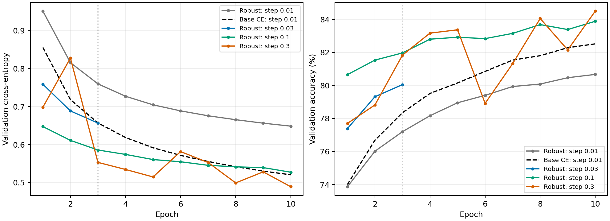
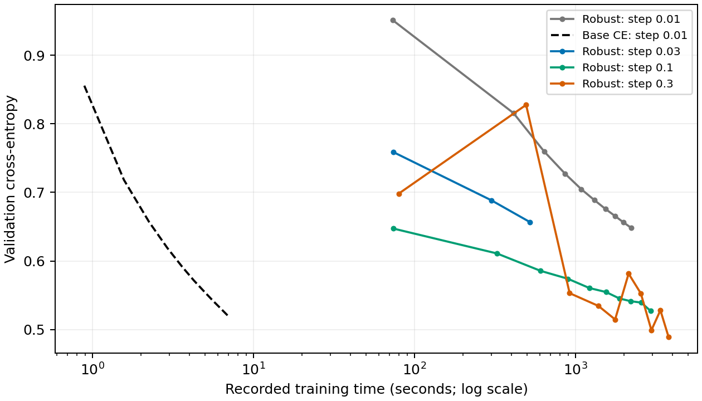

# FashionMNIST: robust learning-rate comparison

Same ten-class split, Matérn-5/2 kernel, seed 42, rho = 8/255, lambda = 0, minibatch 128, constant step, and projection after every epoch as the reference run. The baseline uses plain kernel cross-entropy updates without preconditioning. Robust projection uses dense scalar-kernel storage and EigenPro2 with relative solve tolerance 1e-3 and at most three factor refinement steps.

Step means the effective coefficient step on a full minibatch: `raw_eta * 54000 / 128`. The final minibatch has 112 examples, so its step is 128/112 times this value. Larger rates change only the robust primal step.

## Equal-budget pilot

The protocol screens candidates after 3 complete projected epochs using validation cross-entropy, then extends the chosen candidates to 10 epochs and retains its best validation checkpoint. Test metrics are not used to choose the rate. Recorded completion is shown below.

| Model | Step | Pilot validation CE | Pilot validation accuracy | Selected for extension |
| --- | --- | --- | --- | --- |
| robust_reference | 0.01 | 0.7597 | 77.20% | — |
| baseline | 0.01 | 0.6569 | 78.35% | — |
| step_0.03 | 0.03 | 0.6566 | 80.05% | — |
| step_0.10 | 0.1 | 0.5857 | 81.97% | yes |
| step_0.30 | 0.3 | 0.5531 | 81.83% | yes |

Pilot winner: `step_0.30`.

Protocol amendment: Before any new test evaluation, extend both step 0.10 and step 0.30 to ten epochs: the pilot winner 0.30 oscillated strongly, whereas runner-up 0.10 decreased monotonically. Select the lowest validation CE across both completed ten-epoch runs and the original reference, then evaluate only the selected checkpoint.

Final validation selection: `step_0.30`. Lowest validation cross-entropy among the two ten-epoch extensions and the original ten-epoch robust reference. Both extensions were specified before any new test evaluation; test metrics did not enter selection.

## Available checkpoints

Blank test entries mean no final test result is available. Candidates stopped at the pilot have a smaller training budget. Best validation metrics use all recorded epochs; test metrics belong to the explicitly listed test checkpoint. Earlier evaluation artifacts remain labeled and generate a warning.

| Model | Status | Epochs run | Best validation epoch | Best validation CE | Test checkpoint epoch | Test accuracy | Test CE | PGD accuracy |
| --- | --- | --- | --- | --- | --- | --- | --- | --- |
| robust_reference | evaluated | 10 | 10 | 0.6485 | 10 | 80.64% | 0.6471 | 75.30% |
| baseline | evaluated | 10 | 10 | 0.5205 | 10 | 82.10% | 0.5204 | 73.00% |
| step_0.03 | training_paused | 3 | 3 | 0.6566 | — | — | — | — |
| step_0.10 | training_paused | 10 | 10 | 0.5273 | — | — | — | — |
| step_0.30 | evaluated | 10 | 10 | 0.4890 | 10 | 84.08% | 0.4917 | 79.10% |

Clean test accuracy uses 10,000 examples. PGD uses the same fixed, stratified 1,000-example subset as the reference: Linf 8/255, 20 steps of size 2/255, one random start. This is empirical attack accuracy from one training seed.

## Projection diagnostics

| Model | Largest final squared RKHS distance | Largest remaining distance fraction | Largest training-logit correction error | Training seconds |
| --- | --- | --- | --- | --- |
| robust_reference | 0.5430 | 0.7839 | 0.002068 | 2209.4 |
| baseline | — | — | — | 6.9 |
| step_0.03 | 4.0317 | 0.6716 | 0.005732 | 521.7 |
| step_0.10 | 35.8034 | 0.5390 | 0.031014 | 2922.7 |
| step_0.30 | 205.5632 | 0.3913 | 0.110088 | 3782.5 |

The remaining distance fraction is the final squared RKHS distance divided by the initial squared distance for each projection that needed compression; the table shows the largest observed fraction. A fixed three-step refinement budget compares the implemented algorithms, not exact projected subgradient descent. The projection is nonconvex and approximate. Small kernel-solve residuals do not establish a globally optimal rank-one projection. Squared RKHS distance measures displacement from the unprojected target, not a constraint violation or a certified optimality gap; even an exact nearest projection can have positive distance. Rank-one feasibility holds after projection independently of the refinement stopping reason. The first epoch already has rank-one blocks; later epochs exercise the compression step. Training times come from different GPU models and are not hardware-matched speed comparisons.

Latest completed projection per model:

| Model | Epoch | Initial squared distance | Final squared distance | Factor steps | Termination | Solve relative residual | Solve scaled residual |
| --- | --- | --- | --- | --- | --- | --- | --- |
| robust_reference | 10 | 0.5484 | 0.3512 | 3 | max_steps | 0.000944 | 0.943629 |
| baseline | — | — | — | — | — | — | — |
| step_0.03 | 3 | 4.0067 | 2.5306 | 3 | max_steps | 0.000954 | 0.954022 |
| step_0.10 | 10 | 25.1232 | 5.2445 | 3 | max_steps | 0.000885 | 0.885372 |
| step_0.30 | 10 | 218.5131 | 59.5879 | 3 | max_steps | 0.000953 | 0.953213 |

The scaled solve residual divides each output residual norm by its absolute-plus-relative stopping threshold; at most one means that threshold was met. No solve is needed for the already-rank-one shortcut.

The time axis is logarithmic. Runs used different GPU assignments (recorded in manifest.json), so this shows observed cost rather than a hardware-controlled throughput benchmark. Training seconds include projection work but exclude initial model/kernel-cache setup, validation, checkpoint I/O and final test evaluation.

[Machine-readable comparison](comparison.csv)

## Training surrogate at the pilot boundary

Measured after projection on the same fixed stratified training subset. The mean surrogate is mean CE + rho times mean(max_class sum_input abs(J)). Lambda is zero. These diagnostics were not used to select the learning rate.

| Model | Samples | Mean CE | Mean Jacobian penalty | Mean surrogate |
| --- | --- | --- | --- | --- |
| step_0.03 | 1000 | 0.6453 | 10.2527 | 0.9669 |
| step_0.10 | 1000 | 0.5705 | 10.1923 | 0.8902 |
| step_0.30 | 1000 | 0.5296 | 11.4771 | 0.8897 |

## Training surrogate at each run's best validation checkpoint

The same fixed 1,000-example training subset is used. These diagnostics do not use test data and do not change the validation-CE selection rule.

| Model | Checkpoint epoch | Mean CE | Mean Jacobian penalty | Mean surrogate |
| --- | --- | --- | --- | --- |
| robust_reference | 10 | 0.6372 | 10.2422 | 0.9585 |
| step_0.10 | 10 | 0.5040 | 9.7810 | 0.8109 |
| step_0.30 | 10 | 0.4531 | 10.1002 | 0.7700 |

## Projection refinement sensitivity

One replay of epoch four at effective step 0.30 resumed the same saved epoch-three state on the same GPU. Only the factor-refinement budget changed from three to ten. All logged preprojection minibatch metrics, the initial projection distance and the first three refinement iterates matched exactly. This run was excluded from learning-rate selection and had no test evaluation.

| Factor steps | Final squared RKHS distance | Validation CE | Validation accuracy | Projection seconds | Termination |
| --- | --- | --- | --- | --- | --- |
| 3 | 111.4221 | 0.5345194 | 83.17% | 380.6 | max_steps |
| 10 | 88.3917 | 0.5345353 | 83.17% | 699.6 | max_steps |

Additional refinement reduced distance but had negligible immediate impact on clean validation performance in this replay. This single-epoch check does not establish the effect of using ten steps throughout training.

[Complete sensitivity measurements](projection_sensitivity.json)

## Scalar-kernel storage benchmark

The KLR new_api packed operator was benchmarked on a synthetic symmetric 54,000 by 54,000 float32 matrix with ten output columns. This measures operator arithmetic, not FashionMNIST training or radial-kernel construction. Device: NVIDIA RTX 5000 Ada Generation.

| Storage | Matrix GiB | 128-row product (ms) | Full product (ms) |
| --- | --- | --- | --- |
| dense | 10.863 | 0.055 | 22.207 |
| packed | 5.432 | 66.583 | 3471.864 |

The packed constructor temporarily holds both dense and packed storage (16.30 GiB for the matrices alone). Both products passed analytic-reference and dense-versus-packed checks. The tested packed matrix-right-hand-side path loops over diagonal rows and rectangular tiles in Python. Dense storage fits each available GPU and was retained for the training trials. Derivative contractions remain factored and tiled.

[Full benchmark measurements and provenance](storage_benchmark.json)
